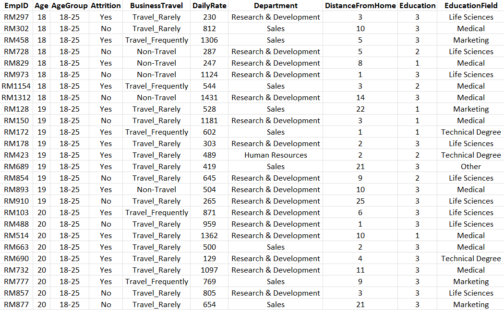
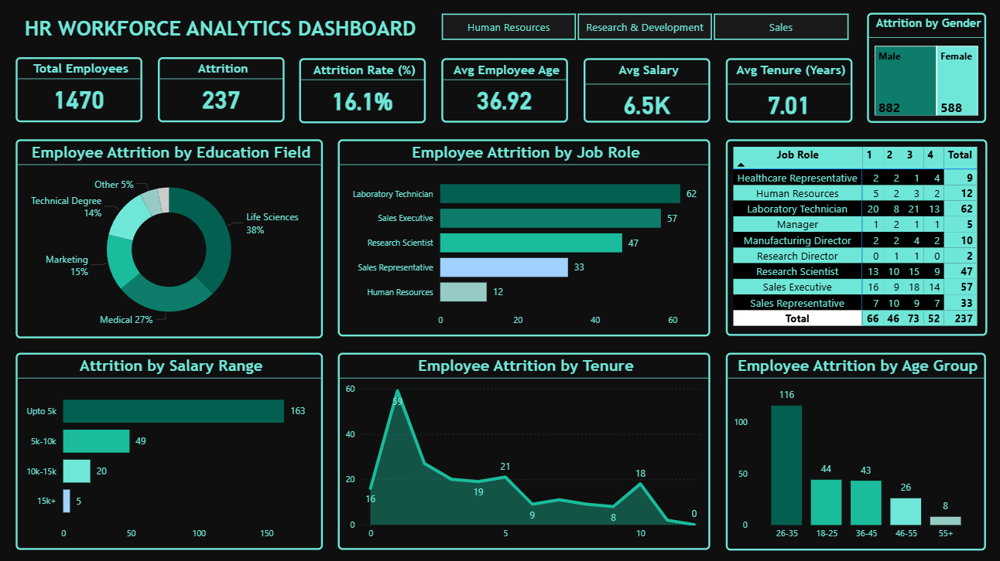

# HR Workforce Analytics & Employee Attrition Analysis – Power BI Dashboard

## Project Overview

Organizations often struggle to understand why employees leave and which factors contribute most to workforce attrition.
This project uses Power BI analytics and visualization to explore employee workforce data and uncover insights related to:

-	Employee attrition
-	Salary distribution
-	Department workforce composition
- Job role turnover
- Employee tenure trends
  
The goal is to transform raw HR data into actionable business insights that support better HR decision-making.

---

## Business Context

Employee attrition is a major concern for organizations because it leads to:

-	Increased recruitment costs
-	Loss of experienced employees
-	Reduced productivity
-	Higher onboarding and training expenses

HR teams need reliable analytics tools to monitor attrition trends and understand workforce dynamics.

This project demonstrates how HR data can be transformed into visual insights using Power BI.

---

## Business Objective

The objective of this analysis is to answer the following business questions:

-	What is the overall employee attrition rate?
-	Which departments experience the highest turnover?
-	Are certain job roles more likely to experience attrition?
-	Does employee salary influence attrition?
-	How does employee tenure impact retention?

The dashboard enables HR stakeholders to identify patterns and make data-driven decisions.

---

## Dataset Preview

 

---
## Dataset Information

The dataset used in this project contains 1,481 rows and 38 columns with multiple HR attributes including demographic information, job roles, salary details, and employment history.

### Dataset Columns

The dataset includes several HR-related attributes used for workforce analysis.

Key columns used in the analysis include:

| Column          | Description                                                  |
| --------------- | ------------------------------------------------------------ |
| EmpID           | Unique identifier for each employee                          |
| Age             | Age of the employee                                          |
| Attrition       | Indicates whether the employee left the company              |
| Department      | Department where the employee works                          |
| JobRole         | Employee job role within the organization                    |
| MonthlyIncome   | Monthly salary of the employee                               |
| YearsAtCompany  | Total number of years the employee has worked at the company |
| Education       | Employee education level                                     |
| Gender          | Gender of the employee                                       |
| JobSatisfaction | Employee job satisfaction rating                             |

  
These attributes help analyze employee demographics, compensation, and workforce trends.

---

## Data Cleaning & Transformation

The dataset was imported into Power BI from the Excel file:

hr_employee_dataset.xlsx

All data preparation and transformation were performed in Power Query Editor.

Cleaning steps included:

-	Verifying and correcting column data types
-	Removing unnecessary columns
-	Ensuring categorical value consistency
-	Reviewing missing or inconsistent values
-	Preparing the dataset for analysis
  
All transformation steps can be viewed in the Applied Steps section of Power Query Editor in the Power BI file.

---

## DAX Measures

Several DAX measures were created to support key HR metrics.

**Total Employees**
Total Employees = 
COUNT('HR_Analytics'[EmpID])

**Employees Left (Attrition)**
Employees left = 
CALCULATE(COUNT('HR_Analytics'[EmpID]),'HR_Analytics'[Attrition] = "Yes")

**Attrition Rate**
Attrition Rate = 
SUM(HR_Analytics[Attrition Count])/SUM(HR_Analytics[EmployeeCount])

These measures enable the dashboard to track employee workforce metrics and attrition trends.

---

## Dashboard Preview

---

## Dashboard Features

### Key Performance Indicators (KPIs)

The dashboard highlights key workforce metrics including:

- **Total Employees** - 1470
- **Attrition** - 237
- **Attrition Rate (%)** - 16.1%
- **Average Employee Age** - 36.92
- **Average Salary** - 6.5K
- **Average Tenure (Years)** - 7.01

These KPIs provide a high-level overview of workforce stability and employee turnover.

---

The Power BI dashboard provides an interactive view of workforce analytics.

Key visualizations include:

-	**Employee Attrition by Education Field**
-	**Employee Attrition by Job Role**
-	**Attrition by Salary Range**
-	**Employee Attrition by Tenure**
-	**Employee Attrition by Age Group**
-	**Department-wise Attrition count**
-	**Attrition by Gender**
  
Users can interact with the dashboard using filters to explore workforce trends across different employee groups.

---

## Business Problems Addressed

The dashboard helps answer several important HR questions:

- Which departments experience the highest employee attrition?
- Which job roles have higher turnover rates?
- Does employee salary influence attrition?
- How does employee tenure impact retention?
- What is the distribution of employees across departments?
  
These insights help organizations improve workforce planning and retention strategies.

---

## Key Insights

Based on the dashboard analysis, several workforce patterns can be identified:

### Department-Level Attrition Differences
The **Sales department** shows relatively higher attrition compared to other departments.

### Job Roles with Higher Turnover
Certain roles such as **Laboratory Technician** and **Sales Representative** experience comparatively higher attrition.

### Salary Influence on Attrition
Employees with **lower monthly income** levels tend to leave more frequently, indicating compensation may play a role in employee retention.

### Higher Attrition Among Early-Tenure Employees
Employees with **0–3 years** of tenure show higher attrition, suggesting potential challenges in onboarding or early career development.

### Workforce Distribution
The majority of employees belong to the **Research & Development department**, making it the largest workforce segment.

---

## Business Recommendations

Based on the analysis, the following recommendations can help improve workforce retention:

- Improve onboarding and engagement programs for new employees.

- Evaluate compensation structures for roles with higher attrition.

- Monitor departments experiencing higher turnover.

- Develop targeted retention strategies for high-risk job roles.

- Strengthen employee engagement initiatives.

---

## Tools Used

-	**Microsoft Excel**
-	**Power BI**
-	**Power Query Editor**
- **DAX (Data Analysis Expressions)**

---

## Skills Demonstrated

This project demonstrates several core data analytics skills including:

- Data Cleaning using Power Query
- Data Visualization using Power BI
- DAX Calculations
- KPI Development
-	Business Insight Generation
- Workforce Data Analysis
- Dashboard Design
- Data Storytelling

---

## Data Workflow

The project follows a simple analytics workflow:

1. Raw Dataset (Excel)  
2. Data Cleaning & Transformation (Power Query)  
3. Data Analysis (DAX Measures)  
4. Data Visualization (Power BI Dashboard)  
5. Business Insights

This workflow demonstrates how raw HR data can be transformed into meaningful workforce insights.

---

## Project Structure

HR-Workforce-Analytics-PowerBI
│
├── dataset
│   └── hr_employee_dataset.xlsx
│
├── dashboard
│   └── hr_workforce_analytics_powerbi.pbix
│
├── images
│   ├── dataset_preview.png
│   └── hr_workforce_analytics_dashboard_preview.png
│
└── README.md

---

## Repository Structure

README.md – Project documentation explaining the business context, objectives, analysis process, dashboard features, and insights.

hr_employee_dataset.xlsx – Raw Dataset containing employee workforce data used for the analysis.

hr_workforce_analytics_powerbi.pbix – Power BI dashboard file containing visualizations and HR analytics insights.

dataset_preview.png – Screenshot preview of the dataset used in the analysis.

hr_workforce_analytics_dashboard_preview.png – Screenshot of the interactive Power BI dashboard.

--- 

## How to Use

1. Download or clone the repository.
2. Open the Power BI dashboard file (.pbix) using Power BI Desktop.
3. Explore the interactive dashboard.
4. Use filters to analyze workforce trends across departments, job roles, and employee tenure.

---

## Author

**Sarvesh Vernekar**

Aspiring Data Analyst passionate about data analytics, visualization, and transforming business data into meaningful insights.
